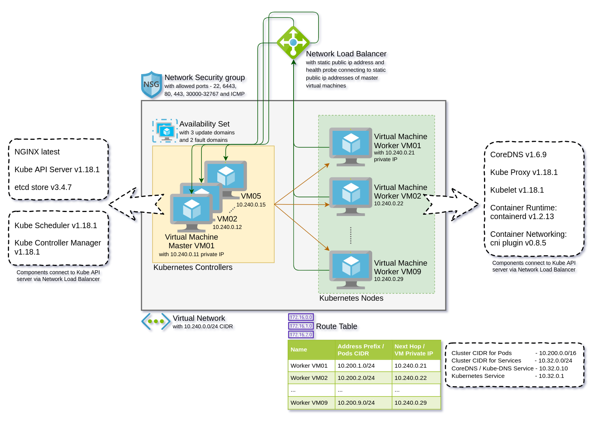

> This tutorial project is a modified version of the original developed by [Kelsey Hightower](https://github.com/kelseyhightower/kubernetes-the-hard-way).

# Kubernetes The Hard Way on Azure

This tutorial project walks you through setting up Kubernetes the hard way. The motivation for this tutorial project is to understand what it takes to set up a fully functioning Kubernetes cluster while utilizing the network, storage and compute resources provided by Microsoft Azure. Even though this tutorial project has deployment automation scripts, it is not meant for people looking to find Microsoft and/or community supported alternative to bring up a Kubernetes cluster in Azure. If that's you then check out [Azure Kubernetes Service](https://azure.microsoft.com/en-gb/services/kubernetes-service/), or the [Getting Started Guides](https://kubernetes.io/docs/setup).

Kubernetes The Hard Way on Azure is optimized for learning, which means taking a not so long route to ensure you understand each task required to bootstrap a Kubernetes cluster. The original long route is shortened with the help of [Terraform](https://www.terraform.io/) and [Bash](https://www.gnu.org/software/bash/) shell scripts for semi automated deployment steps (fun for learning) and also fully automated end to end deployment along with scaling of Kubernetes cluster on Azure.

This tutorial project is a modified version of the original developed by [Kelsey Hightower](https://github.com/kelseyhightower/kubernetes-the-hard-way). While the original one uses GCP as the platform to deploy kubernetes, this project uses Azure. If you prefer the GCP version, refer to the original one [here](https://github.com/kelseyhightower/kubernetes-the-hard-way). There are some more differences to the original and they are documented [here](docs/differences-to-original.md).

> The results of this tutorial should not be viewed as production ready, and may receive limited support from the community, but don't let that stop you from learning!

## Copyright

 This work is licensed under a <a rel="license" href="http://creativecommons.org/licenses/by-nc-sa/4.0/">Creative Commons Attribution-NonCommercial-ShareAlike 4.0 International License</a>.

## Target Audience

The target audience for this tutorial is
* someone planning to support a production Kubernetes cluster and wants to understand how everything fits together,
* someone who wants to setup a quick and cheap yet fully functioning Kubernetes cluster on cloud for dev/test scenarios,
* someone who wants to experience how Azure resources can help with kubernetes cluster setup,
* someone who is familiar with Azure but wants to understand how 'infrastructure as code' works via terraform,
* someone who is familiar with shell scripts but wants to understand how it is used in deployment automation.

## Cluster Details

Kubernetes The Hard Way on Azure guides you through bootstrapping a highly available Kubernetes cluster with end-to-end encryption between components and RBAC authentication.

* [kubernetes](https://github.com/kubernetes/kubernetes) v1.18.1*
* [containerd](https://github.com/containerd/containerd) v1.2.13*
* [coredns](https://github.com/coredns/coredns) v1.6.9*
* [cni](https://github.com/containernetworking/cni) v0.8.5*
* [etcd](https://github.com/coreos/etcd) v3.4.7*
* [nginx](https://www.nginx.com/) latest version  
*all the latest components as of April 2020

## Target deployment architecture

The target of this tutotial project is to achieve the following deployment topology:

* Network
  * [Network Load Balancer](https://docs.microsoft.com/en-us/azure/load-balancer/load-balancer-overview) with external static public ip address to load balance requests for Kube API server.
  * [Network Security Group](https://docs.microsoft.com/en-us/azure/virtual-network/security-overview) as firewall attached to subnet.
  * [Virtual Network](https://docs.microsoft.com/en-us/azure/virtual-network/virtual-networks-overview) with a single subnet to privately host all virtual machines.
  * [Route Table](https://docs.microsoft.com/en-us/azure/virtual-network/virtual-networks-udr-overview) with user defined entries to route network traffic for inter-pod communication accross kubernetes nodes / worker virtual machines.
* Storage
  * [Managed Disks](https://docs.microsoft.com/en-us/azure/virtual-machines/windows/managed-disks-overview) for virtual machines.
* Compute
   * [Linux Virtual Machines](https://docs.microsoft.com/en-us/azure/virtual-machines/linux/overview) with Ubuntu 18.04 LTS OS image. Also, enabled with ip forwarding feature.
   * [Network Interfaces](https://docs.microsoft.com/en-us/azure/virtual-network/virtual-network-network-interface-vm) provide both reserved private ip address and static public ip address.

## Labs

This tutorial project assumes you have access to the [Microsoft Azure](https://portal.azure.com). While Azure is used for basic infrastructure requirements, the lessons learned in this tutorial can be applied to other platforms.

* [Prerequisites and provision infrastructure on cloud](infra/README.md)
* [Install kubernetes in controller / master node](scripts/master/README.md)
* [Install kubernetes in worker node](scripts/worker/README.md)
* [Install coredns and final smoke tests](scripts/deployments/README.md)
* [Automated scale and end to end provisioning](docs/automated-setup.md)
* [Cleaning up](docs/cleanup.md)

## Project structure

This tutorial project has the following folder structure:
* docs and docs/images -  
this folder is a placeholder for documentation and images respectively.
* infra -  
this folder is a placeholder for infrastructure as code in the form of terraform script and associated artifects like terraform state and provider files.
* scripts -  
this folder is a placeholder for all bash shell scripts.
* scripts/master -  
this folder is a placeholder for relavant service, configuration and certificate files needed to setup everything for a kubernetes controller / master node / master virtual machine instance.
* scripts/worker -  
this folder is a placeholder for relavant service, configuration and certificate files needed to setup everything for a kubernetes node / worker virtual machine instance.
* scripts/master/certs and scripts/worker/certs -  
these git ignored folders are a placeholder for dynamically generated client and server certificates to be used in the setup of kubernetes controllers and nodes respectively.
* scripts/master/configs and scripts/worker/configs -  
these git ignored folders are a placeholder for dynamically generated client and server configuration files to be used in the setup of kubernetes controllers and nodes respectively.
* deployments -  
this folder is a placeholder for yaml deployment definition files to be used for deploying workloads on kubernetes cluster.
