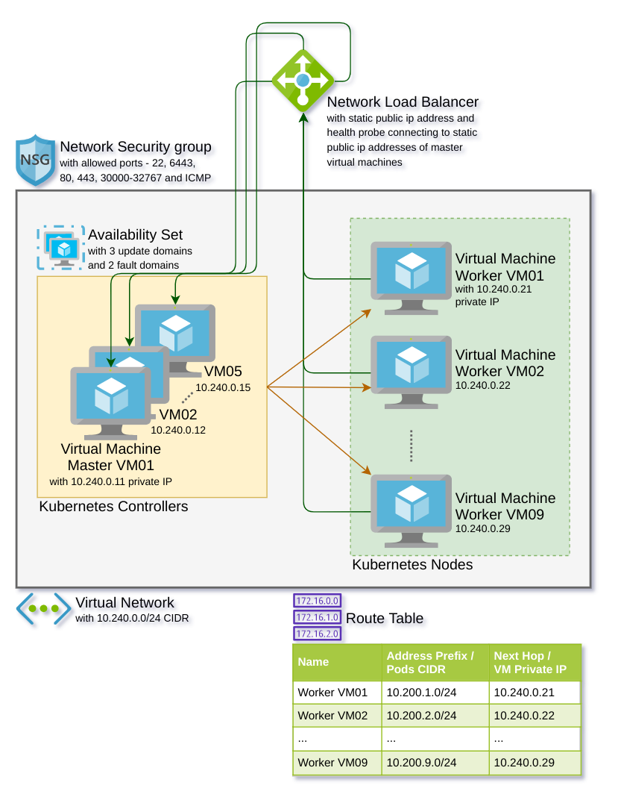

# Install shell script execution platform

## - Choose the running platform
For Windows, there are 3 options:
1. Command Prompt (cmd)
2. Or, Windows Subsystem for Linux (WSL)* on Windows 10: https://docs.microsoft.com/en-us/windows/wsl/install-win10  
3. Or, WSL2* on Windows 10: https://docs.microsoft.com/en-us/windows/wsl/wsl2-install  
*choose Ubuntu 18.04 LTS distro either way

For Linux, there are 2 options:
1. Ubuntu 18.04.4 LTS (Bionic Beaver): https://releases.ubuntu.com/18.04.4/  
2. Or, Ubuntu 20.04 LTS (Focal Fossa): https://releases.ubuntu.com/20.04/  

---
## Instructions for Command Prompt on Windows:

### - Change directory to home in command prompt
```
cd %HOMEDRIVE%%HOMEPATH%
```

### - Install Git in command prompt
* Install Git for Windows: https://git-scm.com/download/win  
**Note** - if you freshly installed git for windows then you need to close and start a new command prompt to refresh path environment variable.

### - Clean kthw-azure-git directory, if already exists
```
rd %HOMEDRIVE%%HOMEPATH%\kthw-azure-git /S
```

### - Clone git repo into kthw-azure git directory
```
git clone https://github.com/ankursoni/kubernetes-the-hard-way-on-azure.git %HOMEDRIVE%%HOMEPATH%\kthw-azure-git
```

### - Install docker in command prompt:
* Install Docker for Windows: https://docs.docker.com/docker-for-windows/install  

### - Build docker image with the image name as kthw-azure-image
```
cd %HOMEDRIVE%%HOMEPATH%\kthw-azure-git\infra
docker build -t kthw-azure-image .
```

### - Run docker container in interactive terminal with kthw-azure-git directory mounted from the host machine
```
docker run -it --name=kthw-azure-container --mount type=bind,source=%HOMEDRIVE%%HOMEPATH%\kthw-azure-git,target=/root/kthw-azure-git kthw-azure-image bash

# if the above command fails with the error 'Unhandled exception: Drive has not been shared' then you need to share your windows home drive (most likely c:) with docker inside docker Settings > Resources > File Sharing
https://stackoverflow.com/questions/59942110/docker-drive-has-not-been-shared

# replace the line ending from \r\n to just \n in all the script files
# this action is needed because the git clone operation happened on command prompt and windows puts \r\n for line endings while linux understands \n for line endings
cd ~/kthw-azure-git/scripts
sed -i 's/\r$//g' *.sh

# to logout from container
exit
```

### - Resume the docker container in interactive terminal
```
# start the containeras it may be in stopped state because of logout
docker start kthw-azure-container

# attach to the current running process - bash in the started container
docker attach kthw-azure-container
```
**Note** - here onwards for next instructions and commands, always run inside docker container using the steps mentioned above

>All done with prerequisites on command prompt, now head to section - [Provision infrastructure on cloud](#provision-infrastructure-on-cloud)

---

## Instructions for Ubuntu, WSL or WSL2 users:

### - Change directory to home in bash terminal
```
cd ~
```

### - Update and upgrade apt packages:
```
{
  sudo apt-get update
  sudo apt-get full-upgrade -y
}
```

### - Install basic prereuisites:
```
sudo apt-get install -y \
     apt-transport-https \
     ca-certificates \
     curl wget unzip tar openssl git \
     lsb-release \
     gnupg-agent gnupg2 \
     software-properties-common
```

### - Clean kthw-azure-git directory, if already exists
```
rm ~/kthw-azure-git -rf
```

### - Clone git repo into kthw-azure git directory
```
git clone https://github.com/ankursoni/kubernetes-the-hard-way-on-azure.git ~/kthw-azure-git
```

---
---

# Install remaining pre-requisites as docker image (recommended)

## - Install docker ce on WSL:
1. Install Docker for Windows: https://docs.docker.com/docker-for-windows/install  
2. Enable docker integration in WSL:  
a. https://docs.microsoft.com/en-us/virtualization/community/team-blog/2017/20171208-wsl-interoperability-with-docker  
b. Or, https://nickjanetakis.com/blog/setting-up-docker-for-windows-and-wsl-to-work-flawlessly

## - Install docker ce on WSL2:
1. Install Docker for Windows: https://docs.docker.com/docker-for-windows/install  
2. Enable docker integration in WSL2: https://code.visualstudio.com/blogs/2020/03/02/docker-in-wsl2

## - Install docker ce on Ubuntu 18.04:
```
{
  curl -fsSL "https://download.docker.com/linux/$(lsb_release -is | tr -td '\n' | tr [:upper:] [:lower:])/gpg" | sudo apt-key add -

  echo "deb [arch=amd64] https://download.docker.com/linux/$(lsb_release -is | tr -td '\n' | tr [:upper:] [:lower:]) \
  $(lsb_release -cs | tr -td '\n' | tr [:upper:] [:lower:]) stable" | sudo tee -a /etc/apt/sources.list.d/docker.list

  sudo apt-get update
  sudo apt-get install -y docker-ce docker-ce-cli containerd.io
}
```

## - Install docker on Ubuntu 20.04:
```
sudo apt-get install docker-compose
```

## - Build docker image with the image name as kthw-azure-image
```
cd ~/kthw-azure-git/infra
docker build -t kthw-azure-image .
```

## - Run docker container in interactive terminal with kthw-azure-git directory mounted from the host machine
```
docker run -it --name=kthw-azure-container --mount type=bind,source=$HOME/kthw-azure-git,target=/root/kthw-azure-git kthw-azure-image bash

# to logout from container
exit
```

## - Resume the docker container in interactive terminal
```
# start the containeras it may be in stopped state because of logout
docker start kthw-azure-container

# attach to the current running process - bash in the started container
docker attach kthw-azure-container
```
**Note** - here onwards for next instructions and commands, always run inside docker container using the steps mentioned above

>All done with prerequisites for docker image, now head to section - [Provision infrastructure on cloud](#provision-infrastructure-on-cloud)

---

# Or, install remaining pre-requisites directly on Linux or WSL host (not recommended)

## - Change directory to home
```
cd ~
```

## - Install az cli
```
# if this fails on latest Ubuntu 20.04, refer to https://docs.microsoft.com/en-us/cli/azure/install-azure-cli-apt?view=azure-cli-latest#manual-install-instructions and replace $AZ_REPO with 'bionic'

curl -sL https://aka.ms/InstallAzureCLIDeb | sudo bash
```

## - Install kubectl
```
{
  curl -s https://packages.cloud.google.com/apt/doc/apt-key.gpg | sudo apt-key add -
  echo "deb https://apt.kubernetes.io/ kubernetes-xenial main" | sudo tee -a /etc/apt/sources.list.d/kubernetes.list
  sudo apt-get update
  sudo apt-get install -y kubectl
}
```

## - Install terraform
```
{
  wget https://releases.hashicorp.com/terraform/0.12.24/terraform_0.12.24_linux_amd64.zip
  unzip terraform_0.12.24_linux_amd64.zip
  sudo mv terraform /usr/local/bin/
  rm terraform_0.12.24_linux_amd64.zip
}
```

## - Verify terraform installation
```
terraform -v
```

---
---

# Provision infrastructure on cloud



## - Set the values for the variables by writing to the var file - azurerm-secret.tfvars
```
cd ~

az login
az account list
# note the id as <SUBSCRIPTION_ID> and tenantId as <TENANT_ID> from the output of previous command

# generate an azure service principal with contributor permissions, if you don't already have one:
az ad sp create-for-rbac --role="Contributor" --scopes="/subscriptions/<SUBSCRIPTION_ID>"
# note the appId as <CLIENT_ID> and password as <CLIENT_SECRET> from the output of previous command

# generate an ssh key, if you don't already have one:
ssh-keygen -b 4096 -t rsa -C <EMAIL_ADDRESS>
# note the path of the file "~/.ssh/id_rsa.pub" as <SSH_PUBLIC_KEY_FILE>

# copy the template variable file
cd ~/kthw-azure-git/infra
cp azurerm.tfvars azurerm-secret.tfvars


# subscription, tenant, service principal and ssh variables

# substitute the value for <SUBSCRIPTION_ID> by replacing PLACEHOLDER in the following command:
sed -i 's|<SUBSCRIPTION_ID>|PLACEHOLDER|g' azurerm-secret.tfvars
# for e.g., the command to substitute the value for <SUBSCRIPTION_ID> with 794a7d2a-565a-4ebd-8dd9-0439763e6b55 as PLACEHOLDER looks like this:
sed -i 's|<SUBSCRIPTION_ID>|794a7d2a-565a-4ebd-8dd9-0439763e6b55|g' azurerm-secret.tfvars

# substitute the value for <TENANT_ID> by replacing PLACEHOLDER in the following command:
sed -i 's|<TENANT_ID>|PLACEHOLDER|g' azurerm-secret.tfvars

# substitute the value for <CLIENT_ID> by replacing PLACEHOLDER in the following command:
sed -i 's|<CLIENT_ID>|PLACEHOLDER|g' azurerm-secret.tfvars

# substitute the value for <CLIENT_SECRET> by replacing PLACEHOLDER in the command
sed -i 's|<CLIENT_SECRET>|PLACEHOLDER|g' azurerm-secret.tfvars

# substitute the value for <SSH_PUBLIC_KEY_FILE> by replacing PLACEHOLDER in the command
# PLACEHOLDER e.g. "~/.ssh/id_rsa.pub"
sed -i 's|<SSH_PUBLIC_KEY_FILE>|PLACEHOLDER|g' azurerm-secret.tfvars


# prefix, environment and location variables
# these 3 variables help in naming the azure resources
# for e.g., resource group name: <PREFIX>-<ENVIRONMENT>-rg01
# for e.g., master virtual machine name: <PREFIX>-<ENVIRONMENT>-mastervm01.<LOCATION_CODE>.cloudapp.azure.com
# for e.g., worker virtual machine name: <PREFIX>-<ENVIRONMENT>-workervm01.<LOCATION_CODE>.cloudapp.azure.com
# for e.g., network load balancer name: <PREFIX>-<ENVIRONMENT>-apiserver.<LOCATION_CODE>.cloudapp.azure.com

# substitute the value for <PREFIX> by replacing PLACEHOLDER in the following command:
# PLACEHOLDER e.g. "kthw" or "kube" etc.
sed -i 's|<PREFIX>|PLACEHOLDER|g' azurerm-secret.tfvars

# substitute the value for <ENVIRONMENT> by replacing PLACEHOLDER in the command
# PLACEHOLDER e.g. "demo" or "play" or "poc" or "dev" or "test" etc.
sed -i 's|<ENVIRONMENT>|PLACEHOLDER|g' azurerm-secret.tfvars

# substitute the value for <LOCATION> by replacing PLACEHOLDER in the command
# PLACEHOLDER e.g. "Australia East" or "Southeast Asia" or "Central US" or "West Europe" etc.
# run this to know more: "az account list-locations -o table"
sed -i 's|<LOCATION>|PLACEHOLDER|g' azurerm-secret.tfvars


# master variables

# substitute the value for <MASTER_VM_SIZE> by replacing PLACEHOLDER in the command
# PLACEHOLDER e.g. "Standard_B1ms" or "Standard_DS2_v2" etc. with ssd disk capabilities indicated by 's'
# run this to know more: "az vm list-sizes --location "<LOCATION>" -o table"
sed -i 's|<MASTER_VM_SIZE>|PLACEHOLDER|g' azurerm-secret.tfvars

# substitute the value for <MASTER_VM_COUNT> by replacing PLACEHOLDER in the command
# PLACEHOLDER e.g. 1 or 2 etc. upto a maximum of 5
# choose 1 if you are learning and later auto-scale
sed -i 's|<MASTER_VM_COUNT>|PLACEHOLDER|g' azurerm-secret.tfvars


# worker variables

# substitute the value for <WORKER_VM_SIZE> by replacing PLACEHOLDER in the command
# PLACEHOLDER e.g. "Standard_B1ms" or "Standard_DS2_v2" etc. with ssd disk capabilities indicated by 's'
# run this to know more: "az vm list-sizes --location "<LOCATION>" -o table"
sed -i 's|<WORKER_VM_SIZE>|PLACEHOLDER|g' azurerm-secret.tfvars

# substitute the value for <WORKER_VM_COUNT> by replacing PLACEHOLDER in the command
# PLACEHOLDER e.g. 1 or 2 etc. upto a maximum of 9
# choose 1 if you are learning and later auto-scale
sed -i 's|<WORKER_VM_COUNT>|PLACEHOLDER|g' azurerm-secret.tfvars


# verify the auzurerm-secret.tfvars file by displaying its content
cat azurerm-secret.tfvars

# output should be something like this
subscription_id="794a7d2a-565a-4ebd-8dd9-0439763e6b55"
tenant_id="<removed as secret>" 
client_id="<removed as secret>"
client_secret="<removed as secret>"
prefix="kthw"
environment="demo"
location="Australia East"
ssh_public_key_file="~/.ssh/id_rsa.pub"
master_vm_size="Standard_B1ms"
master_vm_count=1
master_disk_size_gb=32
worker_vm_size="Standard_B1ms"
worker_vm_count=1
worker_disk_size_gb=32
enable_health_probe=false
enable_master_setup=false
enable_worker_setup=false

# if there is a correction needed then use text editor 'nano' to update the file and then press ctrl+x after you are done editing
nano azurerm-secret.tfvars

# note for users who started from windows command prompt
# replace the line ending from \r\n to just \n in the var file
# this action is needed because the git clone operation happened on command prompt and windows puts \r\n for line endings while linux understands \n for line endings
sed -i 's/\r$//g' azurerm-secret.tfvars
```

## - Deploy infrastructure
```
cd ~/kthw-azure-git/infra

# initialise terraform providers
terraform init

# execute infrastructure provisioning command
terraform apply -var-file=azurerm-secret.tfvars

# if terraform throws any error, it may be due to dns name conflicts with already deployed infrastructure in the chosen azure location.
# try to workaround these errors by changing the values of the variable - prefix or environment or location in the variable values file - azurerm-secret.tfvars
# use text editor 'nano' to update the file and then press ctrl+x after you are done editing
nano azurerm-secret.tfvars
```