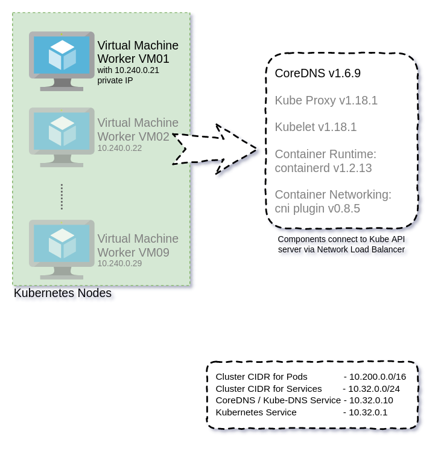

# Install coredns



## Initialisation
```
cd ~/kthw-azure-git/infra

# load variables already set for the infrastructure
source azurerm-secret.tfvars

# determine location code from location
location_code=$(az account list-locations --query "[?displayName=='$location']".{Code:name} -o tsv)
```


## Deploy via coredns deployment definition file
```
cd ~/kthw-azure-git/scripts

kubectl apply -f deployments/coredns.yaml --kubeconfig worker/configs/admin.kubeconfig

# check the newly deployed coredns pods
kubectl get pods -n kube-system --kubeconfig worker/configs/admin.kubeconfig

# output should be something like this
NAME                       READY   STATUS    RESTARTS   AGE
coredns-5d65dd49c8-75bzk   1/1     Running   0          5m
coredns-5d65dd49c8-n6fmb   1/1     Running   0          5m

# get cluster information
kubectl cluster-info --kubeconfig worker/configs/admin.kubeconfig

# output should be something like this
Kubernetes master is running at https://kthw-play-apiserver.australiaeast.cloudapp.azure.com:6443
CoreDNS is running at https://kthw-play-apiserver.australiaeast.cloudapp.azure.com:6443/api/v1/namespaces/kube-system/services/kube-dns:dns/proxy

To further debug and diagnose cluster problems, use 'kubectl cluster-info dump'.
```


## Verification of kubernetes setup after completion of all actions

### Test data encryption of secret data (inside master node)
```
cd ~/kthw-azure-git/scripts

# create a generic secret 
kubectl create secret generic kubernetes-the-hard-way \
  --from-literal="mykey=mydata" --kubeconfig worker/configs/admin.kubeconfig

# remote login to mastervm01
ssh usr1@$prefix-$environment-mastervm01.$location_code.cloudapp.azure.com

cd ~

# print the hexadump of the secret stored in etcd
sudo ETCDCTL_API=3 etcdctl get \
  --endpoints=https://127.0.0.1:2379 \
  --cacert=/etc/etcd/ca.crt \
  --cert=/etc/etcd/etcd-server.crt \
  --key=/etc/etcd/etcd-server.key \
  /registry/secrets/default/kubernetes-the-hard-way | hexdump -C

# output should be something like this
00000000  2f 72 65 67 69 73 74 72  79 2f 73 65 63 72 65 74  |/registry/secret|
00000010  73 2f 64 65 66 61 75 6c  74 2f 6b 75 62 65 72 6e  |s/default/kubern|
00000020  65 74 65 73 2d 74 68 65  2d 68 61 72 64 2d 77 61  |etes-the-hard-wa|
00000030  79 0a 6b 38 73 3a 65 6e  63 3a 61 65 73 63 62 63  |y.k8s:enc:aescbc|
00000040  3a 76 31 3a 6b 65 79 31  3a bc 6b 23 35 d8 ef 6d  |:v1:key1:.k#5..m|
00000050  5c 0d 5b c2 12 5d 7b e2  a7 2b 14 9a 93 4d 9f ee  |\.[..]{..+...M..|
00000060  d7 b1 fc 70 70 64 f5 de  a4 b9 97 fc 30 03 0d c8  |...ppd......0...|
00000070  33 2e da 99 91 e3 df 10  27 0f 07 7a a9 68 45 9d  |3.......'..z.hE.|
00000080  c6 3a 45 48 f4 6d 98 1d  50 55 4e d8 a5 ce e8 8f  |.:EH.m..PUN.....|
00000090  5a 92 06 85 d0 57 e2 18  c2 33 48 af 5e c9 80 15  |Z....W...3H.^...|
000000a0  45 93 87 38 ac dd da 41  d6 56 7c 11 24 14 0c 26  |E..8...A.V|.$..&|
000000b0  94 55 f8 b6 8e 2a 11 54  29 63 b8 f2 fe 3d 19 60  |.U...*.T)c...=.`|
000000c0  c4 e0 99 76 5b 61 f4 f8  38 8c e5 74 80 c6 ef 9f  |...v[a..8..t....|
000000d0  39 5f 46 41 55 a5 61 77  de 7d e5 5e 67 e2 14 96  |9_FAU.aw.}.^g...|
000000e0  84 50 10 4c 36 0f ae 95  19 bf 06 4f b8 ff b5 b6  |.P.L6......O....|
000000f0  40 fa a5 7b b6 c9 ba aa  a3 59 fb 40 c2 5c cf d8  |@..{.....Y.@.\..|
00000100  dc a5 8a 31 46 5b 08 59  e1 5f 65 31 59 33 2d ce  |...1F[.Y._e1Y3-.|
00000110  86 16 14 0c 05 24 fb 85  cc cf d7 c0 a2 0f 89 93  |.....$..........|
00000120  29 23 57 e9 a6 d7 62 90  89 bf 81 b4 19 61 e8 a0  |)#W...b......a..|
00000130  e3 a8 ba 34 72 8f b9 00  0f ac c1 ae ff e3 fc 4b  |...4r..........K|
00000140  5b 8c 26 da 7c 7e ea 5d  29 0a                    |[.&.|~.]).|
0000014a

# the etcd key is prefixed with k8s:enc:aescbc:v1:key1 indicating that the aescbc provider was used to encrypt the data with the key1 encryption key.

# remote logout from mastervm01
logout

# delete the generic secret
kubectl delete secret kubernetes-the-hard-way --kubeconfig worker/configs/admin.kubeconfig
```

### Test executing process inside pod's container
```
cd ~/kthw-azure-git/scripts

# create a busybox pod
kubectl run busybox --image=busybox:1.28 --kubeconfig worker/configs/admin.kubeconfig \
  --command -- sleep 3600

# check the newly deployed busybox pod
kubectl get pods --kubeconfig worker/configs/admin.kubeconfig

# output should be something like this
NAME      READY   STATUS    RESTARTS   AGE
busybox   1/1     Running   0          30s

# execute nslookup command in the busybox container to test dns
kubectl exec -it --kubeconfig worker/configs/admin.kubeconfig busybox -- nslookup kubernetes

# output should be something like this
Server:    10.32.0.10
Address 1: 10.32.0.10 kube-dns.kube-system.svc.cluster.local

Name:      kubernetes
Address 1: 10.32.0.1 kubernetes.default.svc.cluster.local

# delete the busybox pod
kubectl delete pod busybox --kubeconfig worker/configs/admin.kubeconfig
```

### Test accessing an application running inside pod's container using port-forward
```
cd ~/kthw-azure-git/scripts

# create an nginx deployment
kubectl create deployment nginx --image=nginx --kubeconfig worker/configs/admin.kubeconfig

# collect the nginx pod name
pod_name=$(kubectl get pods -l app=nginx -o jsonpath="{.items[0].metadata.name}" \
  --kubeconfig worker/configs/admin.kubeconfig)

# forward port 80 from inside nginx pod to port 8080 on host
kubectl port-forward $pod_name 8080:80 --kubeconfig worker/configs/admin.kubeconfig

# try accessing port 8080 on host in a separate terminal
curl 127.0.0.1:8080
# if you are running this on a container then execute this instead in a new command prompt / terminal
docker exec -it kthw-azure-container curl 127.0.0.1:8080

# output should be something like this
<!DOCTYPE html>
<html>
<head>
<title>Welcome to nginx!</title>
<style>
...

# come back to the original terminal and terminate the port forward by pressing
ctrl+c

# access the nginx pod logs
kubectl logs $pod_name --kubeconfig worker/configs/admin.kubeconfig

# output should be something like this
127.0.0.1 - - [29/Apr/2020:09:37:24 +0000] "GET / HTTP/1.1" 200 612 "-" "curl/7.68.0" "-"

# create service exposed on worker nodeport
kubectl expose deployment nginx --port 80 --type NodePort --kubeconfig worker/configs/admin.kubeconfig

# collect the service node port number
node_port=$(kubectl get svc nginx --output=jsonpath='{range .spec.ports[0]}{.nodePort}' \
  --kubeconfig worker/configs/admin.kubeconfig)

# collect the workervm01 public ip address
node_ip=$(az network public-ip show -g $prefix-$environment-rg01 -n $prefix-$environment-workerpip01 --query "{IP:ipAddress}" -o tsv)

# access the node_port on workervm01
curl $node_ip:$node_port

# output should be something like this
<!DOCTYPE html>
<html>
<head>
<title>Welcome to nginx!</title>
<style>
...

# delete the nginx deployment and service
kubectl delete deployment nginx --kubeconfig worker/configs/admin.kubeconfig
kubectl delete service nginx --kubeconfig worker/configs/admin.kubeconfig
```


## Merge the new cluster's kube config in your default kube config for kubectl commands to run flawlessly
```
# create backup of the default kube config file if already exists
cp ~/.kube/config ~/.kube/config.bak

cd ~/kthw-azure-git/scripts

# export the variable with merge sequence
export KUBECONFIG=master/configs/admin.kubeconfig:~/.kube/config.bak

# write the merged kubeconfig to default kube config file
kubectl config view --flatten > ~/.kube/config

# test out the kubectl command
kubectl cluster-info
# verify if the cluster information is that of your newly provisioned kubernetes cluster

# if you wish to restore your original default kube config file
cp ~/.kube/config.bak ~/.kube/config
```